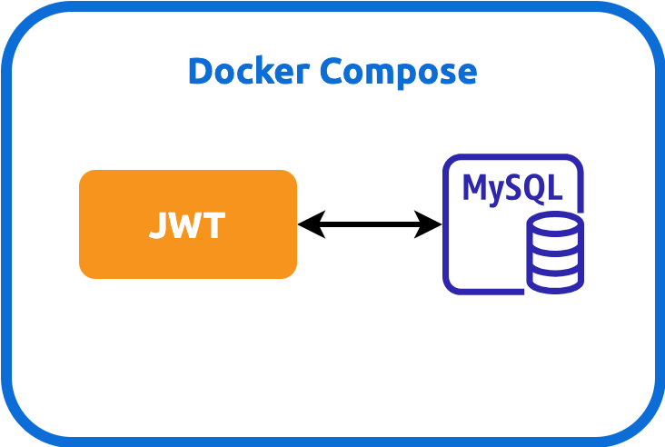

[Jersey Webservice Template] (_JWT_) delegates JPA capabilities to [Elide] and configures Elide through 2 required
Elide [bindings][what is binding]:

1. **[Elide][Elide instance class]**
2. **[ElideSettings][ElideSettings instance class]** with 2 extra sub-bindings:

   - **EntityDictionary**
   - **DataStore**

The binding is referencing [Elide Standalone] in the following way:

:::danger

Although the Jersey binder wraps HK2 binder, we
[must pick the _Jersey binder_ for binding Elide resources](https://github.com/QubitPi/jersey-ws-template/pull/29/files#diff-afa024cc2643aaf681db505cac24b8601c94931290718993392e7726001b1559L39-R40),
otherwise, dependency injection will flaky and not right.

:::


Running Webservice in Docker Compose
------------------------------------

### Step 1: Defining Data Models

To inject [Elide model package](https://github.com/yahoo/elide/tree/master/elide-standalone#create-models), simply put
the models in a separate JAR and include it as a dependency in POM. If the model package is internal and cannot be
visible publicly, either make the webservice project private or public with env variable masking, for example:

```xml
    <dependencies>
        <dependency>
            <groupId>${env.MODEL_PACKAGE_JAR_GROUP_ID}</groupId>
            <artifactId>${env.MODEL_PACKAGE_JAR_ARTIFACT_ID}</artifactId>
            <version>${env.MODEL_PACKAGE_JAR_VERSION}</version>
        </dependency>
    </dependencies>

    ...

    <repositories>
        <repository>
            <id>${env.MODEL_PACKAGE_REPO_ID}</id>
            <name>JPA model pacakge JAR repository</name>
            <url>${env.MODEL_PACKAGE_REPO_URL}</url>
        </repository>
    </repositories>
```

```bash
export MODEL_PACKAGE_JAR_GROUP_ID=com.mycompnay
export MODEL_PACKAGE_JAR_ARTIFACT_ID=my-model-package
export MODEL_PACKAGE_JAR_VERSION=1.0.7

export MODEL_PACKAGE_REPO_ID=my-repo-id
export MODEL_PACKAGE_REPO_URL=https://private.mvnrepository.com/artifact/com.company/my-model-package
```

### Step 2: Spinning Up Docker Compose

Jersey WS Template can run in [Docker Compose] for the following purposes

1. Decoupling frontend and backend developments
2. Making it easy to run E2E testing of Jersey WS Template-backed application in CI/CD

:::caution

Docker Compose designed here is intended for local development and testing purposes ONLY! _It is strongly discouraged
to run this Docker Compose in production!_

:::



Simply run:

```bash
git clone https://github.com/QubitPi/jersey-ws-template.git
cd jersey-ws-template
git checkout jpa-elide
mvn clean package
MODEL_PACKAGE_NAME=$JWT_MODEL_PACKAGE_NAME docker compose up --build --force-recreate
```

where `$JWT_MODEL_PACKAGE_NAME` is the package in config JAR that contains all
[elide models](https://elide.io/pages/guide/v7/02-data-model.html). It can be set, for example, at command line with:

```bash
export JWT_MODEL_PACKAGE_NAME=com.mycompany.jwt.models
```

The variable will be [passed](https://stackoverflow.com/a/58900415) into Docker Compose file.

### Troubleshooting

#### Database Does Not Have My Model Packages's Bean Table

_If tests is running in IntelliJ IDE_, make sure the model package JAR it is in IDE's **External Libraries**

Otherwise, the dependency injection didn't find a bean class under the package specified by
[JWT_MODEL_PACKAGE_NAME](#step-1-defining-data-models)

### Entity Missing Default Constructor

```bash
[main] INFO  o.h.m.i.EntityInstantiatorPojoStandard - HHH000182: No default (no-argument) constructor for
class: ... (class must be instantiated by Interceptor)
```

Simply add a no-args constructor to the bean class.

### How to Exclude GraphQL Feature

To optionally disable GraphQL endpoints, exclude corresponding dependencies in POM. For example:

```xml
        <dependency>
            <groupId>com.yahoo.elide</groupId>
            <artifactId>elide-core</artifactId>
            <version>7.0.0-pr6</version>
            <exclusions>
                <exclusion>
                    <groupId>com.yahoo.elide</groupId>
                    <artifactId>elide-graphql</artifactId>
                </exclusion>
            </exclusions>
        </dependency>
```

[Elide]: https://elide.io/
[Elide instance class]: https://github.com/yahoo/elide/blob/master/elide-core/src/main/java/com/yahoo/elide/Elide.java
[Elide Standalone]: https://github.com/yahoo/elide/tree/master/elide-standalone
[ElideSettings instance class]: https://github.com/yahoo/elide/blob/master/elide-core/src/main/java/com/yahoo/elide/ElideSettings.java

[Jersey Webservice Template]: https://qubitpi.github.io/jersey-ws-template/

[what is binding]: https://qubitpi.github.io/jersey/ioc.html
